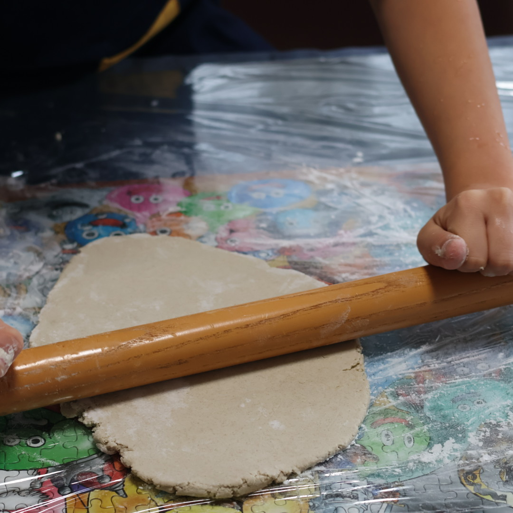

# home activity log

## 冬休みの宿題
```
 - プリント：16ページ
 - タブドリ：通算180分以内で解けるところまで
 - 習字：1枚
 - 硬筆：3枚（提出は1枚）
 - ロイロ新聞：１枚
 - 読書カード：1枚
 - 体力づくり
```
### 自由枠
> 読書📚 | 
> 映画鑑賞🎞️ | 
> 運動🏃‍♂️ |
> 料理🍳　| 
> お手伝い🧺 | 
> パソコン作業💻 |
> 創作🎨 | 
> イベント🐈‍⬛


## 日々の進捗（カッコ内は累積）

### 冬休み前
- タブドリ：+2 
- タブドリ：+9／60分 (計60分）

> その他
> 💻webアプリ基礎作成手伝い

### 12/25
- プリント：+3（計3ページ）
- 硬筆：+2（提出用完成）

> その他
> 🏃‍♂️柔道教室でコマ作り


### 12/26
> 今日は定期通院日
> 
> 🏃‍♂️剣道


### 12/27
- タブドリ：+2
> 🐈‍⬛今日は一日剣道（クリスマスパーティ）


### 12/28
- プリント：+2（計5ページ）
- タブドリ：+5／60分（累計120分）
> 🏃‍♂️グランド一周


### 12/29
- タブドリ：+3／20分（累計140分）
- プリント：+4（計9ページ）
> 🏃‍♂️家の周りを二周


### 12/30
- プリント：+3（計12ページ）
> 🧺ポットのクエン酸洗浄
> 
> 🍳そば打ち
> <a href="assets/images/IMG_2062.jpeg">

</a>
